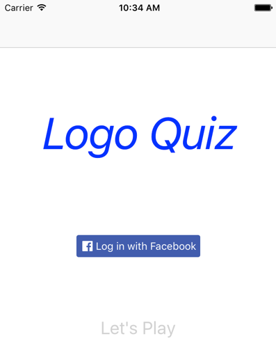
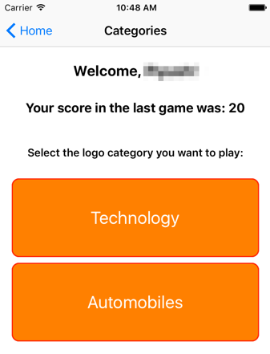
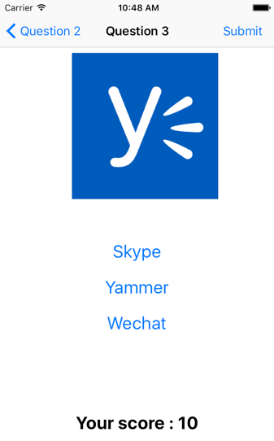

#Mobile Center sample app

This is a sample app developed for iOS platform in Xcode 8.2 & Swift 3.0. 
It demonstrates the integration of services provided through Visual Studio Mobile Center. See [this](https://www.visualstudio.com/vs/mobile-center/) for more details. 

##Overview##
This is a quiz gaming app which shows a logo image to a player and asks them to choose the correct owner from a set of three options. 

The app has the following Mobile Center services integrated in it through Cocoapods:
 
###Azure Mobile App services
Azure Mobile App services of **Idenitity** and **Tables** are integrated in the app. 

Player is asked to sign-in with their Facebook credentials. Facebook identity is configured using the [Facebook Login SDK in Swift](https://developers.facebook.com/docs/swift/login).   

Score from the player's last game is stored in the Azure provided Tables backend and displayed when the player signs in. Using Tables with the Identity service allows easy segregation of data for all the players based on the user id captured through their Facebook authentication. This provides for authenicated access to the backend table for querying and updating. 

The app is also configured for Offline sync capability provided through Tables service. When the app starts up, it fetches the score data from the backend table and stores it locally. All updates are made to this local storage until the next sync with the backend. This ensures that even if the player loses connection while playing the game, the score is persisted and not lost and eventually synced up with the backend database.  

### Analytics
The app shows the following screen asking the player to choose from the category of logos they want to play: 

Selection of 'Technology' category takes the user through a play of three logos which the player has to answer.  

Selection of 'Automobiles' category shows a *Coming Soon* page. 

Mobile Center Analytics SDK is integrated to understand the MAU/WAU/DAU, top devices etc. The app is also instrumented with custom events to answer the two fundamental questions:

1) How many customers are clicking on the 'Automobiles' category and hence interested in seeing it in the game? 

2) Which logo do customers find most difficult by tracking the number of incorrect answers reported for each logo in a gaming session?    

### Crashes 

Mobile Center Crashes SDK is integrated to track any crashes occuring in the app along with their full stack traces. The sample app is simulating a crash when a player incorrectly plays the first two logos.  

In Mobile Center, the following services consitituting the Mobile DevOps cycle of continuous integration and distribution are also integrated in the app.  

###Build 
Build service connects to this Github repo and is configured to produce an installable package of the app with every code checkin. 

###Test
Test service provides for running the app with a set of UI tests on a number of real physical devices without having to own any. It helps in a quick validation of the app on several devices. 

This app uses Calabash framework to create tests and run them through the Test service. It uses a simple test to verify that the "Log in to Facebook" button is indeed present on the screen when the home page shows up for the app. It is a useful validation since this button is added programmatically. 

###Distribute
Distribute service is wired up with Build to send a notification to testers every time a code checkin happens and a build is successfully generated. 

Build, Test & Distribute services constitute the Mobile DevOps cycle of continuous integration and distribution.   

***Note - All trademarks and registered trademarks used in this logo quiz are the property of their respective owners.***
